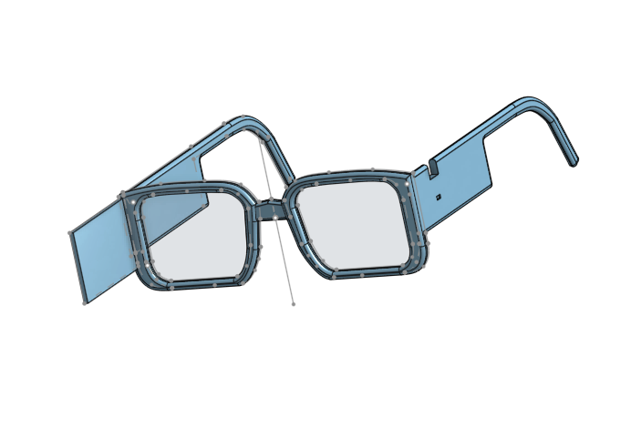
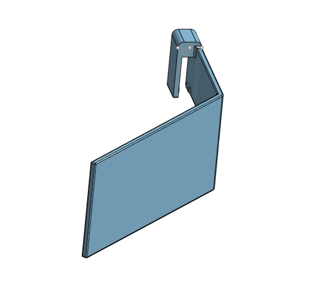

# Smart Glasses
<!---Replace this text with a brief description (2-3 sentences) of your project. This description should draw the reader in and make them interested in what you've built. You can include what the biggest challenges, takeaways, and triumphs from completing the project were. As you complete your portfolio, remember your audience is less familiar than you are with all that your project entails!-->

My project is the Smart Glasses, that can allow you to identify objects in front of you, take pictures, and play video games. It can also display time, and other information you want. It is all connected remotely to my phone, so I can run stuff through there instead of using computer. 


| **Engineer** | **School** | **Area of Interest** | **Grade** |
|:--:|:--:|:--:|:--:|
| Siqi F. | Basis Independent Silicon Valley | Computer Science/Electrical Engineering | Incoming Junior

<!---**Replace the BlueStamp logo below with an image of yourself and your completed project. Follow the guide [here](https://tomcam.github.io/least-github-pages/adding-images-github-pages-site.html) if you need help.**--->

<div style="display: flex !important; align-items: center !important; gap: 20px !important;">
  
</div>


<!------>


# Final Milestone

<!---**Don't forget to replace the text below with the embedding for your milestone video. Go to Youtube, click Share -> Embed, and copy and paste the code to replace what's below.**--->

<iframe width="560" height="315" src="https://www.youtube.com/embed/NWzAUTdtGYo?si=eQ1tF7mJra_kSmYt" title="YouTube video player" frameborder="0" allow="accelerometer; autoplay; clipboard-write; encrypted-media; gyroscope; picture-in-picture; web-share" referrerpolicy="strict-origin-when-cross-origin" allowfullscreen></iframe>

<!---For your final milestone, explain the outcome of your project. Key details to include are:
- What you've accomplished since your previous milestone
- What your biggest challenges and triumphs were at BSE
- A summary of key topics you learned about
- What you hope to learn in the future after everything you've learned at BSE--->

<br>**Accomplishments:**
I've managed to make my own 3d model of the glasses I am going to use with the OLED and camera. I made a seperate piece for the mirror that is detatchable from the glasses as since the mirrors have to be at a 45 degree angle, they will be covering your view slightly. For the OLED, I have flipped the display screen so that we can see it through the mirror, as the display will be reversed by the mirror. There will be an added part in the glasses that will protrude outwards in order to show the OLED. The wires for the OLED will be extended through jumper wires, and help in place by electrical tape. 

**Biggest challenges:**
Some of the biggest challenges I faced was finding a good library for the image recognition portion of the Smart Glasses, as the guide I was given used TensorFlow Lite Object Recognition Library, however the downside of TensorFlow Lite is that it is taylored to specific objects rather than general ones. In my case it was for cups and dog breeds, something that I didn't need to recognize with the glasses. Instead I found a different image library, OpenCV. OpenCV is used most commonly by big companies for object recognition, and especially for more broad topics, which fit what I needed perfectly. Another big problem was connecting my Raspberry Pi to my phone. I wanted to use bluetooth connection, but as I have an IOS phone, connecting through bluetooth requires more tedious processes, such as connecting through BLE (Bluetooth Light Environment), and even then it was hard to find my RaspberryPi in the list of devices. Therefore, I decided connecting through wifi was easier. However this raised another problem, if wifi is required then these glasses would not be truly remote. Instead, I decided to connect to the RaspberryPi's internal hotspot instead so I could connect my phone to the OLED.

**What I learned:**
Before starting BlueStamps Engineering, I had almost no experience in CADing 3d models, especially with complex design. I had used 3d printers in the past, but most designs were relatively simply or predesigned. At BlueStamps, I learned how to use OnShape for 3d modeling objects to print, which I think will be helpful in the future if I make more similar projects. Also, the main language I used for my project was python, as the processor I used was RaspberryPi, which uses python as it's language. I think forcing myself to interact with python has helped me learn more about how to use it for future coding projects.

**Future Plans:**
After everything I've learned at BlueStamps, I plan to use this experience to keep on experimenting and building things for myself. I feel BlueStamps has given me the intiative and experience to help plan my own projects in the future. For my project, I plan to add more software aspects in them as well as fixing some unstable parts of the project, as some parts are still a bit wobbly.


# Second Milestone

<!---**Don't forget to replace the text below with the embedding for your milestone video. Go to Youtube, click Share -> Embed, and copy and paste the code to replace what's below.**--->

<iframe width="560" height="315" src="https://www.youtube.com/embed/ptUMADz4FMY?si=5-arr-m35SlL5tmB" title="YouTube video player" frameborder="0" allow="accelerometer; autoplay; clipboard-write; encrypted-media; gyroscope; picture-in-picture; web-share" referrerpolicy="strict-origin-when-cross-origin" allowfullscreen></iframe>

<!---For your second milestone, explain what you've worked on since your previous milestone. You can highlight:
- Technical details of what you've accomplished and how they contribute to the final goal
- What has been surprising about the project so far
- Previous challenges you faced that you overcame
- What needs to be completed before your final milestone<--->

<br>**Components:**
Aside from the original materials, I have also bought a 1.51 in transparent OLED in order to display text on a mini screen that you can see from the glasses. 

**Technical Progress:**
I've managed to get the OLED up and running, and I can run image recognition software on there. I also managed to connect it to the new library I'm using for object recognition. In the future, these OLEDs will be able to display whatever I tell it too, like video games or the time.

**Challenges:**
Originally, I had planned to use AI recognition instead of a preexisting library, however doing some research into my options for AI revealed that it was not secure, especially the option I was considering, Google Studio Gemini. Instead I had to find a new image library. I am using OpenCV instead, which is for more general recognition and has a more broad amount of recognitions compared to TensorFlow Lite, which is more for specific image recognition.

**Future Plan:**
I am planning to start making a 3d print for holding the components, as the original was too flimsy and couldn't hold up the required materials. I also want to add more fun things to the display, such as a video game. 


# First Milestone

<!---**Don't forget to replace the text below with the embedding for your milestone video. Go to Youtube, click Share -> Embed, and copy and paste the code to replace what's below.**-->

<iframe width="560" height="315" src="https://www.youtube.com/embed/6heKAk21Ivc?si=ubbtS4JYX64GRCiS" title="YouTube video player" frameborder="0" allow="accelerometer; autoplay; clipboard-write; encrypted-media; gyroscope; picture-in-picture; web-share" referrerpolicy="strict-origin-when-cross-origin" allowfullscreen></iframe>

<!---For your first milestone, describe what your project is and how you plan to build it. You can include:
- An explanation about the different components of your project and how they will all integrate together
- Technical progress you've made so far
- Challenges you're facing and solving in your future milestones
- What your plan is to complete your project-->

<br>**Components:**
I'm using the Raspberry Pi 4 Model B and Camera Module to run the Object Recognition Software. This is all possible by using a MicroSd card inside the RaspPi. 

**Technical Progress:**
Some progress I've made is running the Camera Module, and displaying the camera on the VNC I'm using. I connected my computer to a monitor through VNC, which allows me to use the monitor remotely. The program succesfully shows the image detected, what it thinks the object is, and confidence meter.

**Challenges:**
One challenge I faced is that there was no confidence meter. I had to add that in with a new line of code. I did this by multiplying the confidence threshold inside the code by 100 to display the percentage. Another problem I faced was that the detector was displaying objects even when there was a low percentage of confidence. So I raised the confidence threshold, as well as the persistence threshold. The persistence threshold determines how much the object stays inside the screen, and the larger it is, the less likely it is to identify an object off screen. That also solved the problem where the camera was very laggy due to the large processes it was doing. A very big challenge though was that the library I was using was very outdated and inaccurate, which is why I want to change it in the future.

**Future Plan:**
My future plan is hopefully to use AI recognition in the future for more accurate identification, as well as using an OLED to display things through lenses instead of a monitor.


# Schematics 
<!---Here's where you'll put images of your schematics. [Tinkercad](https://www.tinkercad.com/blog/official-guide-to-tinkercad-circuits) and [Fritzing](https://fritzing.org/learning/) are both great resoruces to create professional schematic diagrams, though BSE recommends Tinkercad becuase it can be done easily and for free in the browser.--->

CAD of overall glasses
<br> 
CAD of mirror holder clip on


# Code
<!---Here's where you'll put your code. The syntax below places it into a block of code. Follow the guide [here]([url](https://www.markdownguide.org/extended-syntax/)) to learn how to customize it to your project needs.-->
This is the code from the guide that I used for TensorFlow Lite object recognition, and the modifications I made to it.
```python
import threading
import time
import math
import datetime
import random
import os
import sys
import cv2
import pygame
from flask import Flask, request, jsonify
from luma.core.interface.serial import spi
from luma.oled.device import ssd1309
from luma.core.render import canvas
from PIL import Image, ImageOps, ImageDraw
import socket

serial_conn = spi(device=0, port=0, gpio_DC=25, gpio_RST=27)
device = ssd1309(serial_conn, width=128, height=64)

flip_enabled = False
original_display = device.display

def flipped_display(image):
    if flip_enabled:
        image = ImageOps.mirror(image)
    original_display(image)

device.display = flipped_display

current_command = ""
command_lock = threading.Lock()

def get_command():
    global current_command
    with command_lock:
        cmd = current_command
        current_command = ""
    return cmd

def set_command(cmd):
    global current_command
    with command_lock:
        current_command = cmd

app = Flask(__name__)

@app.route('/')
def index():
    return '''<!DOCTYPE html>
<html>
<head>
    <meta name="viewport" content="width=device-width, initial-scale=1, maximum-scale=1">
    <title>Smart Glasses</title>
    <style>
        * { box-sizing:border-box; margin:0; padding:0; }
        body { background:#0a0a0a; color:#fff; font-family:Arial,sans-serif; min-height:100vh; }
        .header { background:#111; padding:14px; text-align:center; border-bottom:2px solid #0f0; }
        .header h1 { color:#0f0; font-size:18px; letter-spacing:2px; }
        .header p { color:#666; font-size:11px; margin-top:4px; }
        .menu-grid { display:grid; grid-template-columns:1fr 1fr; gap:12px; padding:16px; }
        .menu-btn { background:#111; border:2px solid #333; border-radius:16px; padding:20px 10px;
                    text-align:center; cursor:pointer; transition:all 0.1s; }
        .menu-btn:active { background:#1a1a1a; border-color:#0f0; transform:scale(0.96); }
        .menu-btn .icon { font-size:32px; margin-bottom:8px; }
        .menu-btn .label { font-size:12px; color:#ccc; font-weight:bold; }
        .menu-btn .desc { font-size:10px; color:#555; margin-top:3px; }
        /* Bottom bar for global buttons */
        .bottom-bar { display:flex; gap:10px; padding:0 16px 16px; }
        .bar-btn { flex:1; padding:14px 0; border-radius:12px; font-size:13px;
                   font-weight:bold; cursor:pointer; text-align:center; border:none; }
        .flip-btn { background:#1a1a1a; border:2px solid #05f; color:#05f; }
        .flip-btn.on { background:#05f; color:#fff; border-color:#05f; }
        .flip-btn:active { opacity:0.7; }
        .quit-btn { background:#1a1a1a; border:2px solid #f00; color:#f00; }
        .quit-btn:active { background:#f00; color:#fff; }
        /* Pages */
        .page { display:none; padding:16px; }
        .page.active { display:block; }
        .back-btn { background:#222; border:1px solid #444; color:#aaa; padding:10px 20px;
                    border-radius:8px; font-size:13px; cursor:pointer; margin-bottom:16px;
                    display:inline-block; }
        .back-btn:active { background:#333; }
        .page-title { color:#0f0; font-size:17px; font-weight:bold; margin-bottom:16px; }
        .dpad { text-align:center; margin:10px 0; }
        .dpad-btn { display:inline-block; width:80px; height:80px; background:#1a1a1a;
                    border:2px solid #0f0; border-radius:12px; font-size:32px; line-height:80px;
                    cursor:pointer; margin:4px; user-select:none; -webkit-user-select:none; }
        .dpad-btn:active { background:#0f0; color:#000; }
        .dpad-center { display:inline-block; width:80px; height:80px; background:#111;
                       border:2px solid #222; border-radius:12px; font-size:10px;
                       line-height:80px; color:#444; margin:4px; }
        .big-btn { width:100%; padding:18px; background:#1a1a1a; border:2px solid #0f0;
                   border-radius:12px; color:#fff; font-size:15px; cursor:pointer;
                   margin-bottom:10px; text-align:center; }
        .big-btn:active { background:#0f0; color:#000; }
        .big-btn .icon { font-size:24px; display:block; margin-bottom:5px; }
        .big-btn.red { border-color:#f44; }
        .big-btn.red:active { background:#f44; }
        .big-btn.blue { border-color:#48f; }
        .big-btn.blue:active { background:#48f; }
        .notif-input { width:100%; background:#1a1a1a; border:2px solid #444; border-radius:10px;
                       color:#fff; font-size:16px; padding:14px; margin-bottom:12px; }
        .notif-input:focus { outline:none; border-color:#0f0; }
        .send-btn { width:100%; padding:16px; background:#0f0; border:none; border-radius:10px;
                    color:#000; font-size:16px; font-weight:bold; cursor:pointer; }
        .send-btn:active { background:#0c0; }
        /* Photo result */
        #photo-result { margin-top:12px; padding:12px; background:#1a1a1a; border-radius:10px;
                        font-size:12px; color:#0f0; display:none; text-align:center; }
        /* Status toast */
        #status { position:fixed; bottom:80px; left:50%; transform:translateX(-50%);
                  background:#1a1a1a; border:1px solid #333; color:#0f0; padding:8px 20px;
                  border-radius:20px; font-size:12px; opacity:0; transition:opacity 0.3s;
                  white-space:nowrap; z-index:99; }
        #status.show { opacity:1; }
    </style>
</head>
<body>
<div class="header">
    <h1>⬡ SMART GLASSES</h1>
    <p id="header-sub">Select a mode</p>
</div>

<!-- MAIN MENU -->
<div id="menu">
    <div class="menu-grid">
        <div class="menu-btn" onclick="showPage(\'time-page\');send(\'TIME\')">
            <div class="icon">🕐</div>
            <div class="label">Clock</div>
            <div class="desc">Analog clock on OLED</div>
        </div>
        <div class="menu-btn" onclick="showPage(\'snake-page\');send(\'SNAKE\')">
            <div class="icon">🐍</div>
            <div class="label">Snake</div>
            <div class="desc">Play snake game</div>
        </div>
        <div class="menu-btn" onclick="showPage(\'objdet-page\');send(\'OBJDET\')">
            <div class="icon">📷</div>
            <div class="label">Object Detection</div>
            <div class="desc">AI camera recognition</div>
        </div>
        <div class="menu-btn" onclick="showPage(\'notif-page\')">
            <div class="icon">🔔</div>
            <div class="label">Notifications</div>
            <div class="desc">Send text to OLED</div>
        </div>
        <div class="menu-btn" onclick="showPage(\'photo-page\')">
            <div class="icon">📸</div>
            <div class="label">Take Photo</div>
            <div class="desc">Capture with camera</div>
        </div>
    </div>
    <div class="bottom-bar">
        <div class="bar-btn flip-btn" id="flip-btn" onclick="toggleFlip()">⟺ Mirror OFF</div>
        <div class="bar-btn quit-btn" onclick="confirmQuit()">⏻ Quit</div>
    </div>
</div>

<!-- CLOCK PAGE -->
<div id="time-page" class="page">
    <div class="back-btn" onclick="showMenu();send(\'MENU\')">← Back</div>
    <div class="page-title">🕐 Clock Mode</div>
    <div class="big-btn" onclick="send(\'TIME\')">
        <span class="icon">▶</span>Start Clock
    </div>
    <div class="big-btn red" onclick="showMenu();send(\'MENU\')">
        <span class="icon">⏹</span>Stop
    </div>
</div>

<!-- SNAKE PAGE -->
<div id="snake-page" class="page">
    <div class="back-btn" onclick="showMenu();send(\'MENU\')">← Back</div>
    <div class="page-title">🐍 Snake Controls</div>
    <div class="dpad">
        <div><span class="dpad-btn" ontouchstart="send(\'UP\')" onclick="send(\'UP\')">▲</span></div>
        <div>
            <span class="dpad-btn" ontouchstart="send(\'LEFT\')" onclick="send(\'LEFT\')">◀</span>
            <span class="dpad-center">D-PAD</span>
            <span class="dpad-btn" ontouchstart="send(\'RIGHT\')" onclick="send(\'RIGHT\')">▶</span>
        </div>
        <div><span class="dpad-btn" ontouchstart="send(\'DOWN\')" onclick="send(\'DOWN\')">▼</span></div>
    </div>
    <br>
    <div class="big-btn red" onclick="showMenu();send(\'MENU\')">
        <span class="icon">⏹</span>Quit Game
    </div>
</div>

<!-- OBJECT DETECTION PAGE -->
<div id="objdet-page" class="page">
    <div class="back-btn" onclick="showMenu();send(\'MENU\')">← Back</div>
    <div class="page-title">📷 Object Detection</div>
    <div class="big-btn" onclick="send(\'OBJDET\')">
        <span class="icon">▶</span>Start Camera
    </div>
    <div class="big-btn red" onclick="showMenu();send(\'MENU\')">
        <span class="icon">⏹</span>Stop Camera
    </div>
</div>

<!-- PHOTO PAGE -->
<div id="photo-page" class="page">
    <div class="back-btn" onclick="showMenu()">← Back</div>
    <div class="page-title">📸 Take Photo</div>
    <div class="big-btn blue" onclick="takePhoto()">
        <span class="icon">📸</span>Capture Photo
    </div>
    <div id="photo-result"></div>
    <br>
    <div style="color:#555;font-size:11px;text-align:center">
        Photos saved to ~/Photos/ on Pi
    </div>
</div>

<!-- NOTIFICATIONS PAGE -->
<div id="notif-page" class="page">
    <div class="back-btn" onclick="showMenu()">← Back</div>
    <div class="page-title">🔔 Send Notification</div>
    <input class="notif-input" id="notif-text" type="text"
           placeholder="Type message for OLED..." maxlength="40">
    <button class="send-btn" onclick="sendNotif()">Send to OLED 📤</button>
    <br><br>
    <div style="color:#555;font-size:11px;text-align:center">
        Max 40 characters · Displays for 5 seconds
    </div>
</div>

<div id="status">✓</div>

<script>
let flipOn = false;

function showPage(id) {
    document.getElementById("menu").style.display = "none";
    document.querySelectorAll(".page").forEach(p => p.classList.remove("active"));
    document.getElementById(id).classList.add("active");
}
function showMenu() {
    document.getElementById("menu").style.display = "block";
    document.querySelectorAll(".page").forEach(p => p.classList.remove("active"));
}
function send(cmd) {
    fetch("/command", {
        method:"POST",
        headers:{"Content-Type":"application/json"},
        body: JSON.stringify({command: cmd})
    });
    showStatus(cmd);
}
function sendNotif() {
    const text = document.getElementById("notif-text").value.trim();
    if (!text) return;
    send("NOTIF:" + text);
    document.getElementById("notif-text").value = "";
}
function toggleFlip() {
    flipOn = !flipOn;
    const btn = document.getElementById("flip-btn");
    btn.textContent = flipOn ? "⟺ Mirror ON" : "⟺ Mirror OFF";
    btn.className = "bar-btn flip-btn" + (flipOn ? " on" : "");
    send(flipOn ? "FLIP_ON" : "FLIP_OFF");
}
function takePhoto() {
    const result = document.getElementById("photo-result");
    result.style.display = "block";
    result.textContent = "📸 Taking photo...";
    fetch("/command", {
        method:"POST",
        headers:{"Content-Type":"application/json"},
        body: JSON.stringify({command: "PHOTO"})
    });
    setTimeout(() => {
        fetch("/photo_status")
            .then(r => r.json())
            .then(d => {
                result.textContent = d.message;
            });
    }, 3000);
}
function confirmQuit() {
    if (confirm("Quit Smart Glasses entirely?")) {
        send("QUIT");
        setTimeout(() => {
            document.body.innerHTML = "<div style=\'text-align:center;padding:40px;color:#0f0\'>" +
                "<h2>Smart Glasses stopped.</h2><p style=\'color:#666;margin-top:10px\'>" +
                "Restart by running main.py on the Pi.</p></div>";
        }, 500);
    }
}
function showStatus(msg) {
    const s = document.getElementById("status");
    s.innerText = "✓ " + msg;
    s.classList.add("show");
    setTimeout(() => s.classList.remove("show"), 1200);
}
</script>
</body>
</html>'''

@app.route('/command', methods=['POST'])
def command():
    data = request.get_json()
    set_command(data.get('command', ''))
    print(f"CMD: {current_command}")
    return jsonify({"status": "ok"})

@app.route('/poll')
def poll():
    return jsonify({"command": get_command()})

photo_status_msg = "No photo taken yet"

@app.route('/photo_status')
def photo_status():
    return jsonify({"message": photo_status_msg})

def run_flask():
    app.run(host='0.0.0.0', port=5000, debug=False, use_reloader=False)
def posn(angle, length):
    dx = int(math.cos(math.radians(angle)) * length)
    dy = int(math.sin(math.radians(angle)) * length)
    return (dx, dy)

def run_clock():
    print("Clock mode started")
    while True:
        cmd = get_command()
        if cmd in ('MENU', 'QUIT'):
            if cmd == 'QUIT': do_quit()
            break
        now = datetime.datetime.now()
        cx, cy = 30, 32
        margin = 4
        hrs_angle = 270 + (30 * (now.hour + now.minute / 60.0))
        min_angle = 270 + (6 * now.minute)
        sec_angle = 270 + (6 * now.second)
        hrs  = posn(hrs_angle,  cy - margin - 10)
        mins = posn(min_angle,  cy - margin - 4)
        secs = posn(sec_angle,  cy - margin - 4)
        with canvas(device) as draw:
            draw.ellipse((margin, margin, cx*2-margin, 64-margin), outline="white")
            draw.line((cx, cy, cx+hrs[0],  cy+hrs[1]),  fill="white", width=2)
            draw.line((cx, cy, cx+mins[0], cy+mins[1]), fill="white")
            draw.line((cx, cy, cx+secs[0], cy+secs[1]), fill="white")
            draw.ellipse((cx-2, cy-2, cx+2, cy+2), fill="white")
            draw.text((68, 18), now.strftime("%d %b"), fill="white")
            draw.text((65, 32), now.strftime("%H:%M:%S"), fill="white")
        time.sleep(0.5)
def run_snake():
    print("Snake mode started")
    pygame.init()
    screen = pygame.display.set_mode((256, 128))
    pygame.display.set_caption("Snake")
    sc = pygame.Surface((128, 64))
    clock_pg = pygame.time.Clock()
    font = pygame.font.SysFont(None, 10)
    S = 4
    W, H = 128 // S, 64 // S

    def rnd():
        return (random.randint(0, W-1), random.randint(0, H-1))

    def push(surf):
        img = Image.frombytes('RGB', (128, 64),
                              pygame.image.tostring(surf, 'RGB')).convert('1')
        device.display(img)

    snake = [(W//2, H//2)]
    d = (1, 0)
    food = rnd()
    score = 0
    running = True

    while running:
        for e in pygame.event.get():
            if e.type == pygame.KEYDOWN:
                if e.key == pygame.K_UP    and d != (0, 1):  d = (0, -1)
                if e.key == pygame.K_DOWN  and d != (0, -1): d = (0, 1)
                if e.key == pygame.K_RIGHT and d != (-1, 0): d = (1, 0)
                if e.key == pygame.K_LEFT  and d != (1, 0):  d = (-1, 0)

        cmd = get_command()
        if cmd == 'MENU':
            running = False; break
        elif cmd == 'QUIT':
            running = False; pygame.quit(); do_quit()
        elif cmd == 'UP'    and d != (0, 1):  d = (0, -1)
        elif cmd == 'DOWN'  and d != (0, -1): d = (0, 1)
        elif cmd == 'RIGHT' and d != (-1, 0): d = (1, 0)
        elif cmd == 'LEFT'  and d != (1, 0):  d = (-1, 0)

        h = (snake[0][0]+d[0], snake[0][1]+d[1])
        if not (0 <= h[0] < W and 0 <= h[1] < H) or h in snake:
            break
        snake.insert(0, h)
        if h == food:
            score += 1; food = rnd()
        else:
            snake.pop()

        sc.fill(0)
        for x, y in snake:
            pygame.draw.rect(sc, (255,255,255), (x*S, y*S, S-1, S-1))
        pygame.draw.rect(sc, (255,255,255), (food[0]*S+1, food[1]*S+1, S-2, S-2))
        sc.blit(font.render(str(score), True, (255,255,255)), (112, 1))
        scaled = pygame.transform.scale(sc, (256, 128))
        screen.blit(scaled, (0, 0))
        pygame.display.update()
        push(sc)
        clock_pg.tick(8)

    sc.fill(0)
    f2 = pygame.font.SysFont(None, 16)
    sc.blit(f2.render("GAME OVER", True, (255,255,255)), (20, 22))
    sc.blit(f2.render(f"Score: {score}", True, (255,255,255)), (28, 38))
    push(sc)
    time.sleep(2)
    pygame.quit()
def run_objdet():
    print("Object detection started")
    from picamera2 import Picamera2
    classFile = "/home/siqifeng123/Object_Detection_Files/Object_Detection_Files/coco.names"
    with open(classFile, "rt") as f:
        classNames = f.read().rstrip("\n").split("\n")
    configPath  = "/home/siqifeng123/Object_Detection_Files/Object_Detection_Files/ssd_mobilenet_v3_large_coco_2020_01_14.pbtxt"
    weightsPath = "/home/siqifeng123/Object_Detection_Files/Object_Detection_Files/frozen_inference_graph.pb"
    net = cv2.dnn_DetectionModel(weightsPath, configPath)
    net.setInputSize(320, 320)
    net.setInputScale(1.0 / 127.5)
    net.setInputMean((127.5, 127.5, 127.5))
    net.setInputSwapRB(True)
    picam2 = Picamera2()
    picam2.configure(picam2.create_preview_configuration(
        main={"format": "RGB888", "size": (640, 480)}))
    picam2.start()
    time.sleep(1)
    last_detected = []
    while True:
        cmd = get_command()
        if cmd == 'MENU': break
        if cmd == 'QUIT': picam2.stop(); do_quit()
        img = picam2.capture_array()
        classIds, confs, bbox = net.detect(img, confThreshold=0.50, nmsThreshold=0.4)
        detected = []
        if len(classIds) != 0:
            for classId, confidence in zip(classIds.flatten(), confs.flatten()):
                detected.append(f"{classNames[classId-1]} {int(confidence*100)}%")
        if detected != last_detected:
            with canvas(device) as draw:
                if not detected:
                    draw.text((2, 24), "No object", fill="white")
                else:
                    y = 4
                    for label in detected[:4]:
                        draw.text((2, y), label, fill="white")
                        y += 14
            last_detected = detected
    picam2.stop()
def take_photo():
    global photo_status_msg
    from picamera2 import Picamera2
    print("Taking photo...")
    with canvas(device) as draw:
        draw.text((20, 24), "Taking photo...", fill="white")
    try:
        os.makedirs("/home/siqifeng123/Photos", exist_ok=True)
        timestamp = datetime.datetime.now().strftime("%Y%m%d_%H%M%S")
        filename = f"/home/siqifeng123/Photos/photo_{timestamp}.jpg"
        picam2 = Picamera2()
        picam2.start()
        time.sleep(2)
        picam2.capture_file(filename)
        picam2.stop()
        photo_status_msg = f"✓ Saved: photo_{timestamp}.jpg"
        print(f"Photo saved: {filename}")
        with canvas(device) as draw:
            draw.text((10, 20), "Photo saved!", fill="white")
            draw.text((4, 36), f"{timestamp}", fill="white")
    except Exception as e:
        photo_status_msg = f"✗ Error: {str(e)[:30]}"
        print(f"Photo error: {e}")
        with canvas(device) as draw:
            draw.text((10, 24), "Photo failed!", fill="white")
    time.sleep(2)
def show_notification(text):
    print(f"Notification: {text}")
    words = text.split()
    lines, current = [], ""
    for word in words:
        if len(current + " " + word) <= 21:
            current = (current + " " + word).strip()
        else:
            if current: lines.append(current)
            current = word
    if current: lines.append(current)
    for _ in range(50):
        with canvas(device) as draw:
            draw.text((2, 2), "NOTIFICATION", fill="white")
            draw.line((0, 13, 128, 13), fill="white")
            y = 18
            for line in lines[:3]:
                draw.text((2, y), line, fill="white")
                y += 14
        time.sleep(0.1)
def do_quit():
    print("Quitting Smart Glasses...")
    with canvas(device) as draw:
        draw.text((25, 24), "Goodbye!", fill="white")
    time.sleep(1)
    device.cleanup()
    os._exit(0)
def show_idle():
    with canvas(device) as draw:
        draw.text((20, 20), "Smart Glasses", fill="white")
        draw.text((30, 36), "Ready...", fill="white")
def main():
    global flip_enabled
    t = threading.Thread(target=run_flask, daemon=True)
    t.start()
    print(f"\nSmart Glasses running!")
    print(f"Open on iPhone: http://10.42.0.1:5000\n")
    show_idle()

    while True:
        cmd = get_command()
        if cmd == 'TIME':          run_clock();        show_idle()
        elif cmd == 'SNAKE':       run_snake();        show_idle()
        elif cmd == 'OBJDET':      run_objdet();       show_idle()
        elif cmd == 'PHOTO':
            threading.Thread(target=take_photo, daemon=True).start()
        elif cmd.startswith('NOTIF:'):
            show_notification(cmd[6:]);               show_idle()
        elif cmd == 'FLIP_ON':     flip_enabled = True;  print("Mirror ON")
        elif cmd == 'FLIP_OFF':    flip_enabled = False; print("Mirror OFF")
        elif cmd == 'MENU':        show_idle()
        elif cmd == 'QUIT':        do_quit()
        time.sleep(0.05)

if __name__ == "__main__":
    main()
```

# Bill of Materials
<!---Here's where you'll list the parts in your project. To add more rows, just copy and paste the example rows below.
Don't forget to place the link of where to buy each component inside the quotation marks in the corresponding row after href =. Follow the guide [here]([url](https://www.markdownguide.org/extended-syntax/)) to learn how to customize this to your project needs.--->

| **Part** | **Note** | **Price** | **Link** |
|:--:|:--:|:--:|:--:|
| Raspberry Pi 4 Model B | Running Pi | $120.0 | <a href="https://www.adafruit.com/product/4296"> Link </a> |
| Raspberry Pi Camera | Camera | $29.95 | <a href="https://www.adafruit.com/product/3099"> Link </a> |
| 1.51in Transparent OLED | Miniature Display | $19.99 | <a href="https://www.waveshare.com/1.51inch-transparent-oled.htm?srsltid=AfmBOopQAkjiJT9abj5COolqzPIaRsP3oaVcOENjw4V_90vfQi4OvS79"> Link </a> |
| Mirror | Reflect Screen | $1.00 | <a href="https://www.amazon.com/Circles-Projects-Traveling-Framing-Decoration/dp/B014Q7AVKG"> Link </a> |

# Other Resources/Examples
<!---One of the best parts about Github is that you can view how other people set up their own work. Here are some past BSE portfolios that are awesome examples. You can view how they set up their portfolio, and you can view their index.md files to understand how they implemented different portfolio components.--->
- [TensorFlow Lite Object Recognition](https://learn.adafruit.com/running-tensorflow-lite-on-the-raspberry-pi-4/overview)
- [RaspberryPi Camera tutorial](https://projects.raspberrypi.org/en/projects/getting-started-with-picamera/0)
- [Object Identification with Raspberry Pi](https://core-electronics.com.au/guides/object-identify-raspberry-pi/)
- [Smart Glasses](https://thedinosour.github.io/Chris_BlueStampPortfolio/)
